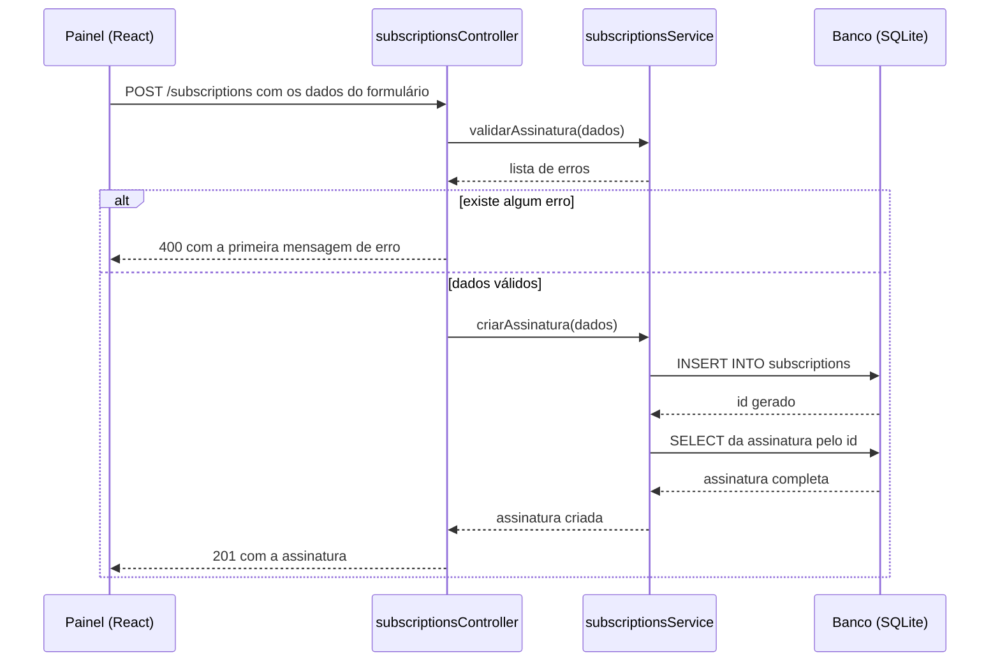
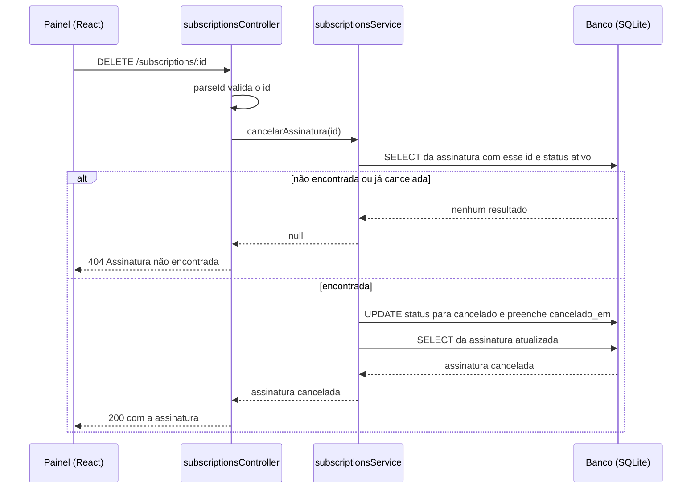
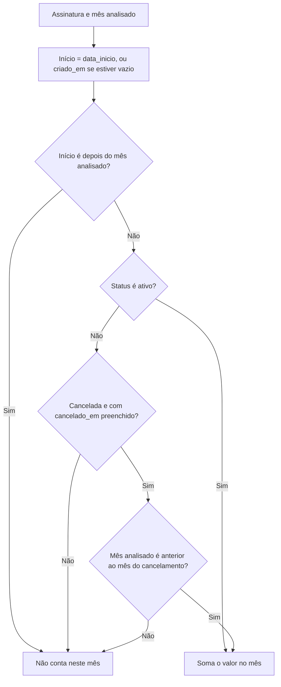
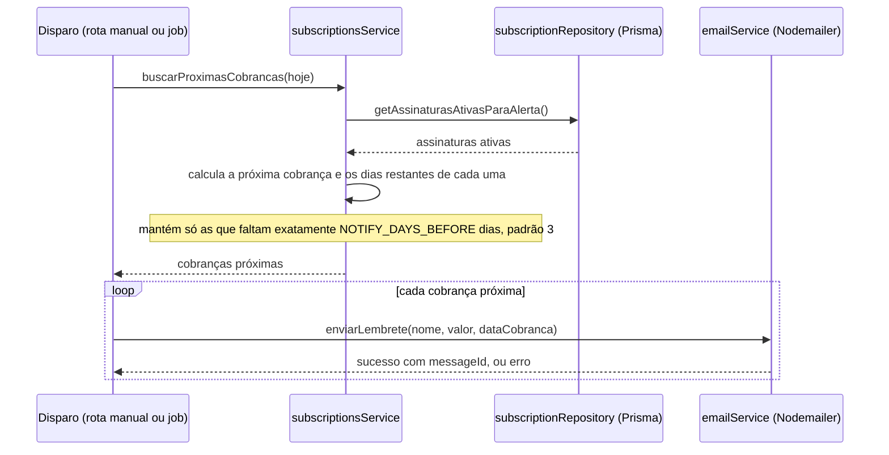

# Gerenciador de Assinaturas

## Time de Desenvolvimento
* **Italo Rodrigues de Matos Avelar** — [Full-Stack]
* **João Victor Tavares Neto** — [Full-Stack]
* **Nathan Filipe Izidorio Alves** — [Full-Stack]
* **Pedro Gabriel Barruetavena Vieira** — [Full-Stack]

---

## Sobre o Projeto

O **Gerenciador de Assinaturas** é um sistema web que permite ao usuário cadastrar e acompanhar todos os serviços de assinatura que ele paga mensalmente (streaming, produtividade, jogos, academias, etc.), reunindo essas informações em um único painel.

### Objetivo do sistema

Centralizar o cadastro e o acompanhamento de assinaturas recorrentes, permitindo que o usuário:
- Tenha visibilidade total de quanto gasta por mês com assinaturas;
- Seja avisado antes de cada renovação, evitando cobranças inesperadas;
- Identifique, por categoria, onde mais gasta;
- Acompanhe a evolução desse gasto ao longo do tempo.

### Escopo do trabalho

O escopo cobre o ciclo completo de gerenciamento de assinaturas (cadastro, edição, remoção e visualização), notificações automáticas de renovação e um dashboard com indicadores e gráficos de gastos. O desenvolvimento segue a metodologia **Scrum**, com entregas organizadas em sprints e backlog de produto gerenciado no board do time.

---

## Tecnologias Utilizadas

* **Linguagem / Runtime:** Node.js
* **Framework Backend:** Express
* **Banco de Dados:** PostgreSQL (ou SQLite em ambiente de desenvolvimento)
* **Frontend:** React
* **Notificações:** Nodemailer (e-mail) e/ou Telegram Bot API
* **Agendamento de tarefas:** node-cron
* **Versionamento:** Git / GitHub
* **Gestão do Backlog:** GitHub Projects

---

## Metodologia

O projeto é desenvolvido seguindo o framework **Scrum**, com:
- Backlog do produto mantido no GitHub Projects, vinculado às issues do repositório;
- Divisão do trabalho em sprints;
- Reuniões periódicas de planejamento e revisão de sprint.

---

## Backlog do Produto — Histórias de Usuário

| # | História de Usuário |
|---|---|
| 1 | Como usuário, quero cadastrar uma assinatura (nome, valor, data de cobrança, categoria) para começar a rastrear meus gastos recorrentes. |
| 2 | Como usuário, quero ver uma lista de todas as minhas assinaturas ativas para ter uma visão geral do que estou pagando. |
| 3 | Como usuário, quero ver o valor total que gasto por mês somando todas as assinaturas para entender o impacto no meu orçamento. |
| 4 | Como usuário, quero receber uma notificação (e-mail ou Telegram) alguns dias antes da renovação de uma assinatura para não ser cobrado de surpresa. |
| 5 | Como usuário, quero editar os dados de uma assinatura (valor, data, nome) para manter as informações atualizadas quando o preço mudar. |
| 6 | Como usuário, quero cancelar/remover uma assinatura da lista quando eu parar de usar o serviço, para meu painel refletir a realidade. |
| 7 | Como usuário, quero visualizar um gráfico com a evolução dos meus gastos mensais com assinaturas para identificar tendências ao longo do tempo. |
| 8 | Como usuário, quero categorizar minhas assinaturas (streaming, produtividade, jogos, etc.) para entender em quais áreas gasto mais. |

---

## Como Executar o Projeto

### 📋 0. Pré-requisitos

Garante que tenha instalado no teu ambiente:
* **Node.js** (versão LTS recomendada)
* **npm** ou **yarn**
* **Git**

### 🛠️ 1. Passo a Passo - Backend

1. **Entrar no diretório do backend:**
   ```bash
   cd backend
   ```

2. **Instalar as dependências:**
   ```bash
   npm install
   ```

3. **Configurar as Variáveis de Ambiente:**
   Copie o `.env.example` para `.env`:
   ```bash
   cp .env.example .env
   ```
   *Abra `.env` criado e ajuste a string de conexão da base de dados (caso necessário) e/ou credenciais de notificação (Nodemailer / Telegram Bot).*

4. **Sincronizar a base de dados (Prisma):**
   ```bash
   npx prisma migrate dev
   ```

5. **Iniciar o servidor do Backend:**
   ```bash
   npm run dev
   ```

6. **Teste o servidor:**
   ```bash
   http://localhost:3001
   ```

### 💻 2. Passo a Passo - Frontend

1. **Abrir um novo terminal e entrar no diretório do frontend:**
   ```bash
   cd frontend
   ```

2. **Configurar as Variáveis de Ambiente:**
   Copie o `.env.example` para `.env`:
   ```bash
   cp .env.example .env
   ```

3. **Instalar as dependências:**
   ```bash
   npm install
   ```

4. **Iniciar a aplicação React:**
   ```bash
   npm run dev
   ```

### 📌 Links de Acesso Local

* **Backend:** http://localhost:3001 (ou em outra porta definida no `.env`)
* **Frontend:** http://localhost:5173

## Documentação em UML

> Diagramas em [Mermaid](https://mermaid.js.org/), renderizados automaticamente pelo GitHub. Gerados com apoio de IA a partir do código do backend, e revisados pelo time antes de entrar no repositório.

### 1. Diagrama de Sequência — Cadastrar assinatura (US1)

Mostra o caminho de um cadastro: o controller valida os dados no service e só então grava no banco. Se houver qualquer erro, a API responde 400 e nada é salvo.



### 2. Diagrama de Sequência — Cancelar assinatura (US6)

O cancelamento é lógico: o registro continua no banco com status `cancelado` e a data em `cancelado_em`, o que mantém o histórico do gráfico. Como a busca só considera assinaturas ativas, cancelar duas vezes a mesma assinatura devolve 404.



### 3. Diagrama de Atividades — Regra do gráfico de evolução (US7)

O gráfico mostra os últimos 12 meses. Para cada mês, o método `calcularHistoricoMensal` percorre todas as assinaturas e usa esta regra (`estavaAtivaNoMes`) para decidir se o valor entra na soma daquele mês.



### 4. Diagrama de Sequência — Notificação de renovação (US4)

Mostra como o sistema descobre quais assinaturas devem receber lembrete: calcula a próxima cobrança de cada assinatura ativa e mantém só as que faltam exatamente `NOTIFY_DAYS_BEFORE` dias (padrão 3). Para cada uma, dispara um e-mail via Nodemailer. Falhas de envio não interrompem as demais.


